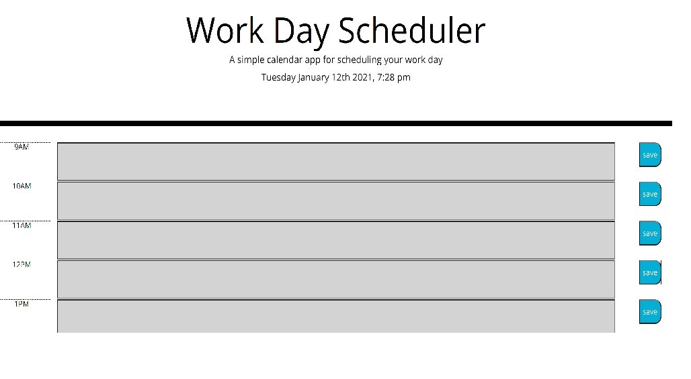

# WorkScheduler2021
Work Day Planner
Steps taken for the HTML Page
1. I added rows columns using the bootstrap classes and added buttons
2. I added the hour css class to the columns That have the time
3. I added an id to all the input and button tags
4. I added text that said save on the buttons

Steps taken for the CSS Page
1. I changed the size of the save buttons
2. I changed the text color of the present, past, and future classes to black

Steps taken for the Logic.js file
1. I added the moment function date and time 
2. I added an event listener for the save buttons
3. I added localstorage to the input fields that are connected ot the save buttons
4. I added a for loop so each button doesn't overwrite the text in the other inputs
5. I added the moment.hour class and set a for loop and if statement to run through all the rows
   and add the class of present, past, and future to the correct rows.

IMAGE of the SCHEDULER

https://github.com/JosephRhines/WorkScheduler2021
https://josephrhines.github.io/WorkScheduler2021/
